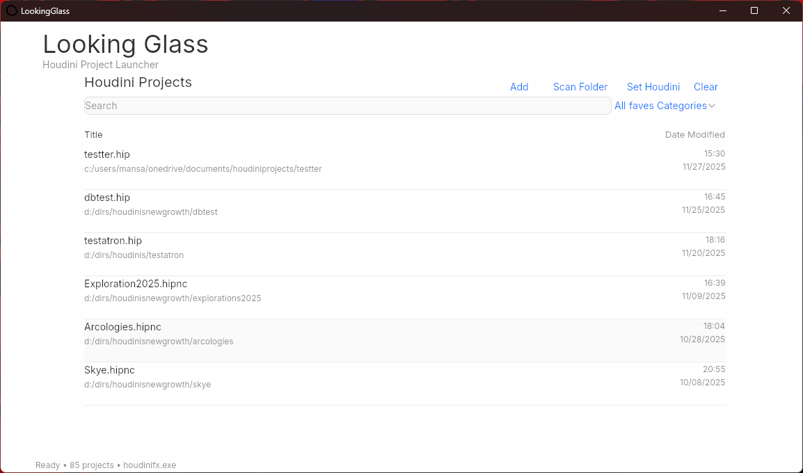

# Looking Glass
**Houdini Project Launcher** | Version 1.0.0 (Alpha)

A lightweight project manager for SideFX Houdini. Scan, organize, and launch your .hip files from one place.

## Installation

1. Download `Project Looking Glass Installer.exe` from the Installer folder
2. Run the installer
3. Launch Looking Glass from Start Menu or desktop

## Requirements

- Windows 10/11
- SideFX Houdini (any version)

## Quick Start

1. Click **Set Houdini** → select `houdinicore.exe`
2. Click **Scan Folder** → choose your projects directory
3. Right Click to open in Houdini

## Features

- Scan folders for `.hip`, `.hipnc`, `.hiplc` files
- Favorite projects for quick access
- Organize by category (Procedural, Simulation, VEX, Tutorials, Demos, Archived)
- Real-time search
- Right-click context menu

## Known Limitations

- Windows only
- UI not fully responsive on all screen sizes

## Changelog

### v1.0.0 (November 2025)
- Initial alpha release
- SQLite database for project management
- Folder scanning with bulk import
- Favorites and categories system
- Search functionality
- Context menu actions

## Support

[hakeemadam.info](https://hakeemadam.info/procedural-tools)